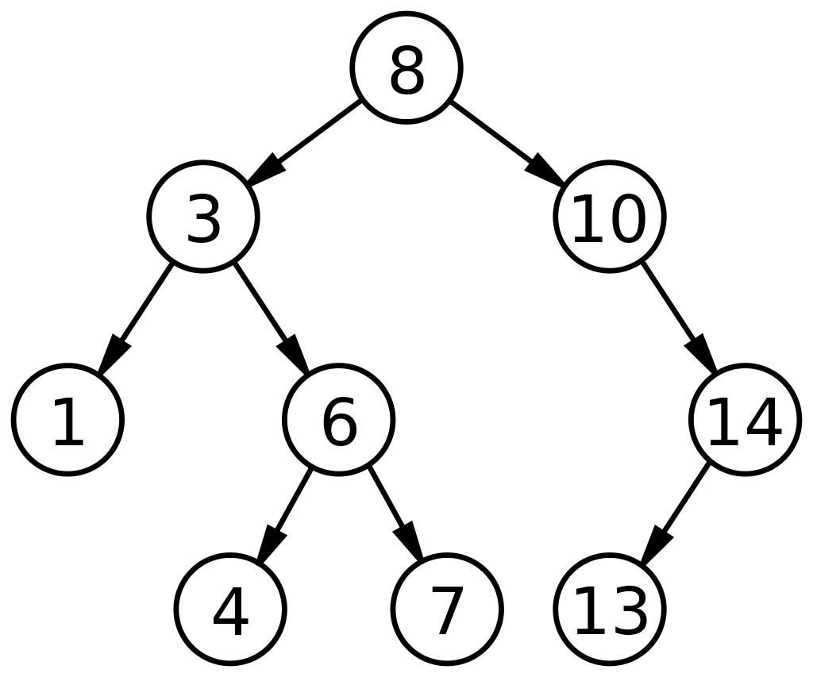
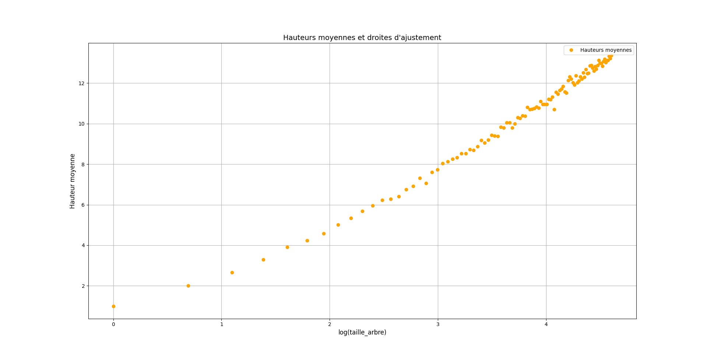

# Synthèse :  Arbres Binaires de Recherche

## Présentation

Un Arbre Binaire de Recherche est une structure de donnée, comparable à un Arbre Binaire, dans laquelle les nœuds représentent les éléments qui la compose. Un Arbre Binaire peut être représenté par un triplet $(racine, sous-arbre\space gauche, sous-arbre \space droit)$, dans lequel tous les nœuds du sous-arbre gauche ont une valeur inférieure ou égale à celle de la racine, et ceux du sous-arbre droit ont une valeur strictement supérieure à celle de la racine, et ce de manière récursive, qu'elle que soit la taille de l'arbre. L'une des manières employée afin d'attester de la bonne composition de l'arbre consiste à effectuer un parcours infixe sur les nœuds de celui-ci. Nous présenterons les différents parcours dans cette synthèse. Ce parcours doit renvoyer une liste de valeurs ordonnée de manière croissante, dans le cas où l'arbre est bien un arbre binaire de recherche. Nous nommerons ces arbres *"ABR"* dans la suite de cette synthèse, et noterons *"sag"* et *"sad"* les abréviations respectives de "sous-arbre gauche" et "sous-arbre droit".

En moyenne, les différentes opérations dans un ABR s’exécutent en temps logarithmique $\Theta(\log n)$ (cela revient à dire $\Theta(h)$, où $h$ est la hauteur de l'arbre, une variable à croissance logarithmique, comme nous le démontrerons dans la dernière partie). Si l'arbre est déséquilibré, c'est à dire qu'il comporte des chemins très courts et d'autres très longs, la complexité change de classe et devient linéaire, $\Theta(n)$.

## Types d'ABR

Il existe plusieurs types d'arbres dont certains sont présentés ci-dessous :

- Arbres **Filiformes** : Arbre dans lequel chaque nœud à 0 ou 1 fils

- Arbre **Peigne** : Arbre Filiforme pour lequel le sous-arbre non vide est toujours le même (sous-arbre gauche ou sous-arbre droit)

- Arbre **Equilibré** : Arbre dont tous les chemins, de la racine aux feuilles, ont la même longueur

- Arbre **Complets** : Arbre composé de $2^h$ nœuds à la profondeur $h$

- Arbre **Binaire Parfait** : Arbre dont tous les niveaux sont remplis, sauf éventuellement le dernier, les feuilles étant regroupées le plus à gauche.

- Arbre **Binaire Localement Complet** : Arbre dans lequel chaque nœud a 0 ou deux fils. Pour tout arbre localement complet à $n$ nœuds internes, il y'aura toujours $n+1$ feuilles (une de plus que le nombre de nœuds internes).

## Mesures sur les ABR

Il est possible d'effectuer diverses mesures et calculs sur les Arbres Binaires de Recherche, en voici quelques uns :

La **taille** d'un arbre est le nombre de ses nœuds. Ainsi, pour un arbre $A$, par définition récursive :
$taille(A) = 0$ si $A$ est vide (composé d'aucun nœuds),
$taille(A) = 1 + taille(sag) + taille(sad)$ dans le cas où $A$ correspond au triplet $(r, sag, sad)$

La **profondeur** d'un nœud $x$ d'un arbre $A$ est le nombre d'arêtes du chemin entre la racine et $x$. On dit que :
$p(x) = 0$ si $x$ est la racine de $A$,
$p(x) = 1 + hauteur(y)$ si $y$ est le nœud parent de $x$.

Enfin, la **hauteur** d'un arbre correspond la profondeur maximale de l'arbre. Il est admis que :
$h(A) = -1$ si $A$ est vide, 
$h(A) = 1$ si $A$ n'est composé que d'un seul nœud (sa racine),
$h(A) = 1 + max(h(sag), h(sad))$ si $A$ est un arbre composé de plus de deux nœuds, ou du type $A=(r, sag, sad)$.

## Parcours des nœuds

Un parcours correspond à l'application d'un traitement sur tous les nœuds de l'arbre, dans un ordre qui respecte la structure de celui-ci. Différents parcours sont envisageables, on les divise en deux catégories : les **parcours récursifs** et les **parcours itératifs**.

Il existe trois parcours récursifs :

- Le parcours **préfixe**, dans lequel les nœuds sont traités après leur père, dès qu'ils sont visités.

- Le parcours **infixe**, dans lequel les nœuds sont traités après leurs fils gauches et avant leurs fils droits.

- Le parcours **suffixe**, dans lequel les nœuds sont traités après leurs deux fils.

Prenons comme exemple l'arbre suivant : 

Dans cet arbre, un parcours préfixe donnerais l'ensemble de nœuds suivant : *r, a, c, h, d, i, j, l, b, e, k, f*, un parcours infixe : *c, h, a, i, d, l, j, r, k, e, b, f* et un parcours suffixe : *h ,c ,i ,l, j, d, a, k, e, f ,b, r*.

Voici des exemples d'algorithmes pour ces trois parcours :

    fonction ParcoursInfixe(A):
        si A = vide
            retourner []
        sinon A = (racine,FilsGauche,FilsDroit)
            retourner ParcoursInfixe(FilsGauche) + [racine] + ParcoursInfixe(FilsDroit)

	fonction ParcoursPréfixe(A):
        si A = vide
            retourner []
        sinon A = (racine,FilsGauche,FilsDroit)
            retourner [racine] + ParcoursPréfixe(FilsGauche) + ParcoursPréfixe(FilsDroit)

	fonction ParcoursSuffixe(A):
        si A = vide
            retourner []
        sinon A = (racine,FilsGauche,FilsDroit)
            retourner ParcoursSuffixe(FilsGauche) + ParcoursSuffixe(FilsDroit) + [racine]

En fonction du parcours choisi, et dans le cas où les valeurs des nœuds seraient des opérations et des opérandes,  une expression arithmétique sera plus ou moins ambiguë. On utilise des parenthèses et des conventions sur les ordres de priorité afin de réduire ces ambiguïtés. A titre d'exemple, l'expression "$1+2*3$" est infixée, elle est ambigüe (on ne sait pas s'il faut appliquer la multiplication en premier ou bien l'addition). L'expression "$+*1\space2\space3$" quant à elle n’est pas ambiguë, on sait qu’il faut appliquer l’addition aux deux premiers entiers, et la multiplication au résultat du premier calcul et au dernier entier. Cet exemple utilise la notation NPI (numérotation polonaise inversée). Les expressions préfixées et suffixées ne sont quant à elles jamais ambiguës.

Dans le cas des parcours itératifs, on traite chaque nœud par ordre de profondeur ou de largeur : Un nœud à la profondeur $p$ sera traité si et seulement si tous les nœuds de profondeur $p-1$ l'ont étés. Il en va de même pour les parcours en largeur.

### Opérations sur les arbres

Il est possible de réaliser différentes opérations sur les arbres binaires de recherche et sur les nœuds qui les composent. Les trois opérations les plus utilisées sont la **recherche** d'éléments, l'**insertion** de nœuds et leur **suppression**.

La **recherche** dans un arbre binaire d'un nœud ayant une clé particulière est un procédé récursif. On commence par examiner la racine. Si sa clé est la clé recherchée, l'algorithme se termine et renvoie la racine. Si elle est strictement inférieure, alors elle est dans le sous-arbre gauche, sur lequel on effectue alors récursivement la recherche. De même si la clé recherchée est strictement supérieure à la clé de la racine, la recherche continue dans le sous-arbre droit. Si on atteint une feuille dont la clé n'est pas celle recherchée, on sait alors que la clé recherchée n'appartient à aucun nœud, elle ne figure donc pas dans l'arbre de recherche.

La recherche est une opération qui requiert un temps en $O(log(n))$ dans le cas moyen, et $O(n)$ dans le cas où l'arbre est déséquilibré.

    fonction Recherche(A,e)
        Si A = vide
            retourner Faux
        Sinon A = (racine,FilsGauche,FilsDroit)
            Si racine = e
                retourner Vrai
            Sinon si e < racine
                retourner Recherche(FilsGauche,e)
            Sinon
                retourner Recherche(FilsDroit,e)

**L'insertion** d'un nœud commence par une recherche : on cherche la clé du nœud à insérer ; lorsqu'on arrive à une feuille, on ajoute le nœud comme fils de la feuille en comparant sa clé à celle de la feuille : si elle est inférieure, le nouveau nœud sera à gauche ; sinon il sera à droite. La complexité est la même que pour la recherche : $O(log(n))$ dans le cas moyen et $O(n)$ sinon.

	fonction Insertion(A,e)
        Si A = vide
            retourner (e,[],[])
        Sinon A = (racine,FilsGauche,FilsDroit)
            Si e < racine
                retourner (racine,Insertion(FilsGauche,e),FilsDroit)
            Sinon
                retourner (racine,FilsGauche,Insertion(FilsDroit,e))

La **suppression** est une opération plus complexe, il faut commencer par rechercher la clé du nœud à supprimer dans l'arbre. Dans le cas le plus simple, si ce nœud est une feuille, il suffit de l'enlever. Dans le cas d'un nœud n'ayant qu'un fils, il faut l'enlever et remplacer par son fils.  Enfin, dans le dernier cas, celui où le nœud à supprimer comporte deux fils, c'est à dire un sous-arbre gauche et un sous-arbre droit, il faut l'échanger avec son plus proche successeur ou son plus proche prédécesseur. Le successeur correspond au nœud le plus à gauche du sous-arbre droit, le prédécesseur quant à lui est le nœud le plus à droite du sous-arbre gauche. Après cet échange, le nœud sera soit une feuille, soit un nœud avec un seul fils.

Dans tous les cas, l'opération de suppression nécessite un parcours de l'arbre, de la racine jusqu'à une feuille. Le temps d'exécution est donc proportionnel à la profondeur de l'arbre, qui vaut $n$ dans le pire des cas, d'où une complexité maximale en $O(n)$.

	fonction Suppression(A,e)
	    si A = vide
	        retourner []
	    sinon A = (racine,FilsGauche,FilsDroit)
	        si e > racine
	            retourner (racine,FilsGauche,Suppression(FilsDroit,e))
	        si e < racine
	            retourner (racine,Suppression(FilsGauche,e),FilsDroit)
	        sinon racine = e
	            si FilsGauche = vide et FilsDroit = vide
	                retourner []
	            si FilsGauche = vide
	                retourner FilsDroit
	            si FilsDroit = vide
	                retourner FilsGauche
	            sinon
	                y = Max(FilsGauche)
	                retourner (y,Suppression(FilsGauche,y),FilsDroit)

## Campagne d'expérimentation

Dans le cadre de cette synthèse sur les arbres binaires de recherche, nous avons effectué une campagne d'expérimentation, afin de démontrer que la hauteur moyenne d'un ABR de taille $n$ est une variable à croissance logarithmique. Afin d'illustrer cette hypothèse, nous avons, par l'intermédiaire de fonctions Python, choisi de réaliser des graphiques mettant en exergue la complexité liée au calcul des hauteurs moyennes d'ABR.

### Définition : Hauteur d'un ABR

Comme décrit en amont, la hauteur d'un arbre est la profondeur maximale de celui-ci, c'est à dire à la profondeur du nœud le plus éloigné de la racine. La plus grande hauteur possible pour un arbre binaire de taille $n$ est $n$, là où sa profondeur maximale correspond à $n-1$. Un arbre binaire qui atteint ce minimum est dit **équilibré**.

Nous admettons les propriétés suivantes :

$hauteur(A) = 0$ si $A$ est un arbre vide,

$hauteur(a) = 1$ si $A$ est un arbre réduit à un seul nœud (sa racine),

$hauteur(A) = 1 + max(h(sag), h(sad))$ si $A$ est un arbre composé d'au minimum deux nœuds.

Prenons comme exemple l'arbre suivant, que nous noterons $ABR$ :

Cet arbre est bien un ABR, il correspond au triplet $(racine, sag, sad)$ et dans lequel les valeurs de $sag$ sont bien inférieures ou égales à la racine, et celles de $sad$ sont strictement supérieures. Cet ABR est composé de neuf nœuds, on peut donc établir que $taille(ABR) = 9$.

Pour ce qui est de sa hauteur, cet arbre n'étant ni vide, ni réduit à un seul nœud, nous pouvons, avec la propriété établie précédemment, déduire que $hauteur(ABR)$ = 4.

### Démonstration : Calcul de la hauteur moyenne pour un ABR de taille $n$

Nous avons commencé notre campagne d'expérimentation par la réalisation d'une fonction permettant de créer des arbres binaires de recherche d'une taille spécifique. Les nœuds de ces arbres sont composés de valeurs aléatoirement choisies entre 0 et la taille de l'arbre. Nous faisons appel à la fonction *insere()* afin d'insérer ces nœuds dans l'arbre.

    def randomTreeCreator(size):
	    abr = Abr()
	    l = [k for k in range(size)]
	    random.shuffle(l)
	    for i in range(len(l)):
	        abr = abr.insere(l[i])
	    return abr

A titre d'exemple, un appel à cette fonction, en remplaçant le paramètre *size* par 3, produira un arbre d'une hauteur qui, comme nous l'avons vu précédent, sera variable, et égale soit à deux, soit à trois. 

Nous nous sommes par la suite adonnés à la réalisation d'une fonction $hauteur()$, prenant comme paramètre un ABR, qui, en fonction de sa composition, et en utilisant les propriété vues au préalable, nous renvoie sa hauteur. Voici le code de cette fonction, qui  traite le cas des arbres vides, de ceux réduits à leur racine, et de ceux composés d'au moins deux nœuds :

    def hauteur(abr):
        if abr.is_empty():
            return 0
        else:
            left_height = abr.get_left_subtree().hauteur() if abr.get_left_subtree() else 0
            right_height = abr.get_right_subtree().hauteur() if abr.get_right_subtree() else 0
            return max(left_height, right_height) + 1

Notez que dans le dernier cas, la hauteur de chaque sous-arbre est calculée de manière récursive. Par exemple, la hauteur d'un arbre composé de deux nœuds sera forcément égale à deux, mais celle d'un arbre composé de trois nœuds sera soit de deux, dans le cas d'un arbre composé d'une racine, d'un sous-arbre gauche et d'un sous-arbre droit, soit de trois, si ce dernier est un arbre filiforme (composé d'une racine et d'un sous-arbre ayant lui-même un sous-arbre, rangés du même coté ou non). Ainsi, à partir de ce code pour un arbre binaire de recherche nommé ABR, il est possible d'établir les égalités suivantes :

$hauteur(ABR) = 1 \to taille(ABR) =1$

$hauteur(ABR) = 2 \to taille(ABR) =2$

Par contre, lorsque $taille(ABR) =3$, $hauteur(ABR) = 2$ ou  $3$

Dans le cadre de notre campagne d'expérimentation, nous avons besoin de valeurs précises et représentatives des cas moyen. Nous ne pouvons prendre en compte des arbres dont les hauteurs varient d'un essai à un autre. Pour remédier à cela, nous avons utilisé une fonction permettant de réaliser $n$ appels à *randomTreeCreator()*, et d'effectuer une moyenne des résultats obtenus pour des arbres d'une taille spécifique. Cette fonction est la suivante :

    def averageTreeHeight(treeSize, n):
	    return average([randomTreeCreator(treeSize).hauteur() for i in range(n)])
	    
Le premier paramètre de cette fonction correspond à la taille de l'arbre, le second au nombre d'itérations à effectuer. La fonction *average()* calcule la moyenne de la somme des éléments d'une liste en fonction de sa longueur. En continuant d'illustrer le fonctionnement de ces fonctions avec notre exemple, dans lequel $taille(ABR) = 3$,  on peut noter que $averageTreeHeight(3, 1000)$ renvoie 2.66. En moyenne, sur 1000 essais, la hauteur d'un arbre de taille 3 est de 2.66.

### Graphique des hauteurs moyennes d'un ABR

En effectuant des calculs similaires, pour des arbres d'une taille comprise entre 1 et $n$, il est possible d'établir un graphique présentant les hauteurs moyennes obtenues pour chaque arbre. Voici une fonction réalisant des graphiques (plots en anglais) à l'aide des modules numpy et matplotlib en Python, et le graphique réalisé pour des arbres d'une taille comprise entre 1 et 10 nœuds :

    def plotter(treeSize, n):
	    x = [i * 1 for i in range(1, treeSize+1)]
	    y = [averageTreeHeight(i, n) for i in range(1, treeSize+1)]
	    plt.plot(x, y, 'o-')
	    plt.show()

Par l'intermédiaire de cette représentation, il est aisé d'observer la hauteur moyenne d'un arbre de taille $n$, et de se rendre compte de l'évolution de cette valeur, quand la taille de l'arbre augmente. Dans le cas d'un arbre de taille 3, la hauteur de ce dernier semble correspondre à 2.66. Notez que ce graphique à été produit en effectuant 100 passes pour chaque arbre, la précision relative à la valeur des hauteurs moyennes serait accrue en augmentant ce nombre.

Voici un second exemple pour des arbres d'un taille comprise entre 1 et 100, toujours avec une hauteur moyenne calculée en effectuant 100 itérations de la fonction $averageTreeHeight()$ :

En augmentant le nombre d'arbres à traiter, nous pouvons observer que la courbe produite semble correspondre à une courbe logarithmique. Ce graphique semble bien démontrer l'hypothèse que nous avions initialement établie.

## Pour aller plus loin

Après la réalisation de courbes démontrant que la hauteur moyenne d'ABR est une variable à complexité logarithmique, nous souhaitons démontrer que cette dernière peut être calculée selon une équation mathématique, définie comme telle : $h=a\log(n)+b$, où $h$ correspond à la hauteur de l'arbre et $n$ la taille de l'arbre. Les variables $a$ et $b$ sont déterminées par des fonctions d'ajustement, l'une se basant sur la méthode de Mayer, l'autre mettant en pratique une régression linéaire. 

Nous commençons par adapter notre fonction réalisant des graphiques en modifiant les valeurs de l'axe des abscisses afin que celui-ci soit lié aux logarithmes de la taille des arbres, et non à leur taille. Le graphique obtenu est alors le suivant :

Ce graphique est une série de valeurs, représentés sous la forme d'un nuage de point allongé, condition essentielle pour que nous puissions créer des droites d'ajustement. 

La première méthode d'ajustement, celle de Mayer, consiste à diviser les points du nuage en deux sous-groupes, et de calculer le point moyen de chaque groupe. A partir de ces deux points moyens, il est possible de calculer les valeurs des variables $a$ et $b$.  Ainsi, selon cette méthode, $a = (yGroupeB - yGroupeA) / (xGroupeB  - xGroupeA)$ et $b = yGroupeA - a*xGroupeA$.

Voici le code de la fonction de l'ajustement de Mayer : 

    def mayerAdjustment(x: list[float], y: list[float]):
	    Mi = [(x[i], y[i]) for i in range(len(x))]
	    Mi.sort()
	    xa, ya = pointMoyen(Mi[:len(Mi)//2]) #Point moyen premier groupe
	    xb, yb = pointMoyen(Mi[len(Mi)//2:]) #Point moyen second groupe
	    a = (yb - ya) / (xb - xa)
	    b = ya - a*xa
	    return (a, b)

La seconde méthode, celle par régression linéaire, est plus complexe. Il faut, dans un premier temps, calculer le point moyen du nuage, puis calculer les variances $V(x)=\frac{1}{n}\sum x_i^2 - \overline{x}^2$ et $V(y)=\frac{1}{n}\sum y_i^2 - \overline{y}^2$,  ainsi que la covariance $cov(x,y)=\frac{1}{n}\sum (x_i-\overline{x})(y_i-\overline{y})$. 
Par cette méthode, $a = \frac{cov(x,y)}{V(x)}$ et $b = \overline{y}-(a*\overline{x})$.

Voici le code de la fonction de l'ajustement par régression linéaire : 

    def regressionLineaire(x: list[float], y: list[float]):
	    varianceX = np.var(x)
	    varianceY = np.var(y)
	    covarianceXY = np.cov(x, y)[0][1]
	    a = covarianceXY/varianceX
	    b = average(y)-(a*(average(x)))
	    r2 = a/varianceY 
	    return (a, b)

Notez ici que le coefficient $r2$ nous fournit une estimation de la qualité de la régression : plus il est proche de 1, meilleur est l'ajustement.

Enfin, en effectuant une mesure de la hauteur moyenne sur cent arbres d'une taille allant de 1 à 100, nous trouvons les valeurs associées aux deux variables $a$ et $b$ selon ces deux méthodes :  

*Avec l'ajustement de Mayer* : $a = 3.255, b = -1.794$
*Avec l'ajustement par régression linéaire* : $a = 3.089, b = -1.190$

En adaptant l'équation $h=a\log(n)+b$, nous trouvons que :
$h=3.255\log(100) -1.794 = 13.197$ pour la méthode de Mayer, et $h=3.089\log(100) -1.190 = 13.036$ pour la méthode de la régression linéaire. Par les tests que nous avons effectués, la hauteur moyenne pour un arbre de $h = 100$ est de $13.253$. Une légère différence est donc notable, mais cette différence est nulle lorsque l'on prend en compte toutes les hauteurs moyennes. 

Nous réalisons enfin le graphique présentant les deux droites d'ajustement crées par l'équation $ax+b$, définies selon les deux méthodes d'ajustement.

Ces deux droites passent par le point moyen du nuage, représenté en rouge sur cette capture d'écran. 
